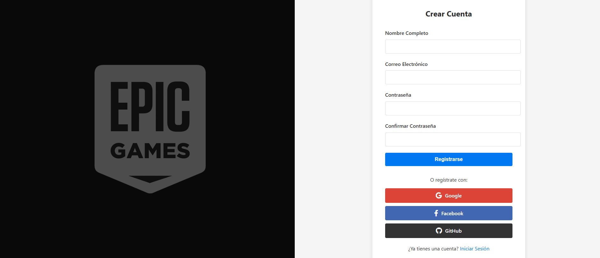
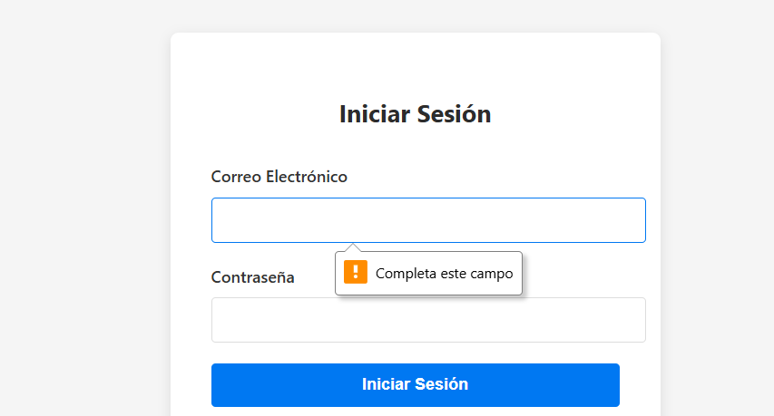

# 🔐 Login de Demostración - Epic Games (Simulado)

Este proyecto consiste en una **interfaz de inicio de sesión y registro ficticia**, inspirada visualmente en plataformas como *Epic Games*.  
Está diseñada únicamente con fines **educativos y de práctica**, sin conexión a bases de datos ni almacenamiento de usuarios.  
**Todos los procesos son simulados en el navegador usando HTML, CSS y JavaScript puro.**

---

## 📄 Características

- Formulario de **inicio de sesión** con validación básica.
- Formulario de **registro** con verificación de contraseñas.
- Simulación de autenticación sin servidor.
- Login social ficticio (Google, Facebook, GitHub).
- Alternancia dinámica entre formularios de login y registro.
- Estilo visual moderno y diseño responsivo.

---

## 🧪 Funcionalidad (100% simulada)

- Al presionar **Iniciar sesión** o **Registrarse**, se ejecuta una validación simple en el navegador.
- No se almacenan datos ni se conectan a un backend.
- Las redirecciones posteriores al login son **ficticias** (`epic-games.html`, `pagina.html`).
- Los botones sociales muestran una alerta simulada.

---

## 🛠️ Tecnologías utilizadas

- **HTML5**
- **CSS**
- **JavaScript (sin frameworks)**
- **Font Awesome** para íconos sociales

---

## 📖 Explicación del código

### 🔹 HTML

- La estructura se divide en dos secciones principales:
  - `.left-section`: muestra una imagen de fondo con estilo y color de superposición.
  - `.right-section`: contiene los formularios de **login** y **registro**.
  
- Ambos formularios (`#login-form` y `#register-form`) están en el mismo archivo, pero uno se oculta mediante la clase `.hidden` usando JavaScript.

- Cada formulario contiene campos con `label` y `input`, un botón principal y enlaces para alternar entre login y registro.

- También se incluyen botones sociales ficticios con iconos de Font Awesome.

---

### 🔹 CSS

- Estilos personalizados para lograr un diseño atractivo y limpio:
  - Uso de **flexbox** para disposición de columnas.
  - Fondo con imagen y superposición para la parte izquierda.
  - Estilo moderno para inputs y botones.
  - Responsive con media query (`max-width: 768px`).

- Clases importantes:
  - `.container`: contenedor flex principal.
  - `.form-container`: caja con sombra que contiene cada formulario.
  - `.social-btn`: botones de redes sociales con colores personalizados.

---

### 🔹 JavaScript

#### Alternancia de formularios
```js
document.getElementById('show-register').addEventListener('click', function(e) {
    e.preventDefault();
    document.getElementById('login-form').classList.add('hidden');
    document.getElementById('register-form').classList.remove('hidden');
});
```

## 📸 Capturas de pantalla

### Login


### Formulario de registro


### Valicadión de correo y contraseña


### Página a la que se accede


---

## ⚠️ Limitaciones

- ❌ No conecta a ninguna API ni base de datos.
- ❌ No almacena usuarios reales.
- ✅ Ideal para fines de **practica**, pruebas de estilo, simulaciones visuales y ejercicios educativos.


